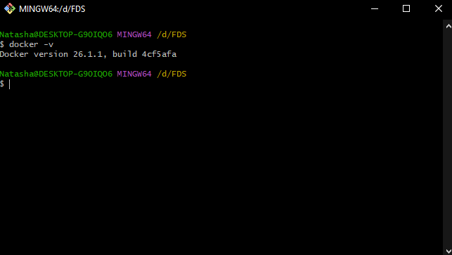
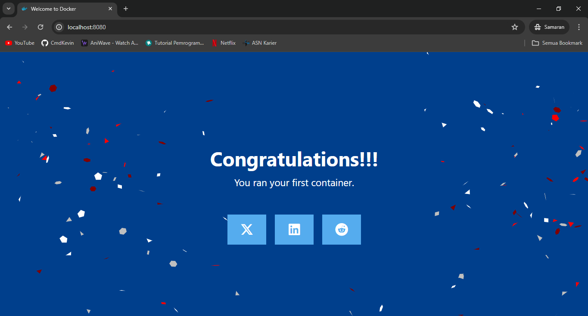
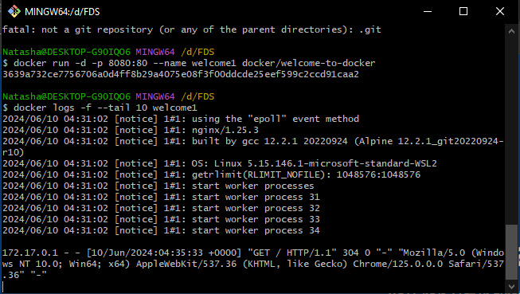
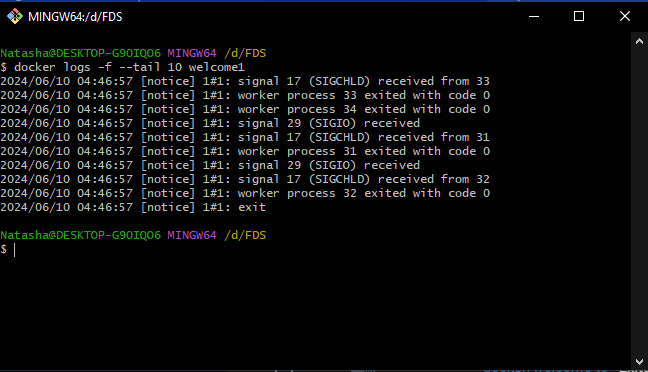
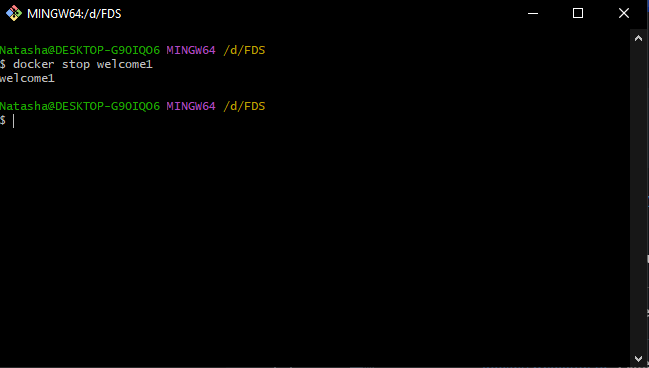

# learning-docker

## Docker Version



## Running Image Docker docker/welome-to-docker

Install menggunakan dengan perintah di bawah
1. -d untuk running background terminal
2. --name untuk memberikan nama Image
3. 8080:80 port (bebasoport)

```sh
docker run -d -p 8080:80 --name welcome1 docker/welcome-to-docker
```

## Running Preview


## Mengecek Log Running Container

1. welcome1 nama file container
2. tail untuk cek log terakhir
3. 10 jumlah log terakhir

```sh
docker logs -f --tail 10 welcome1
```



## Mengecek Log Stop Container


## Docker Stop Container Service

```sh
docker stop welcome1
```
