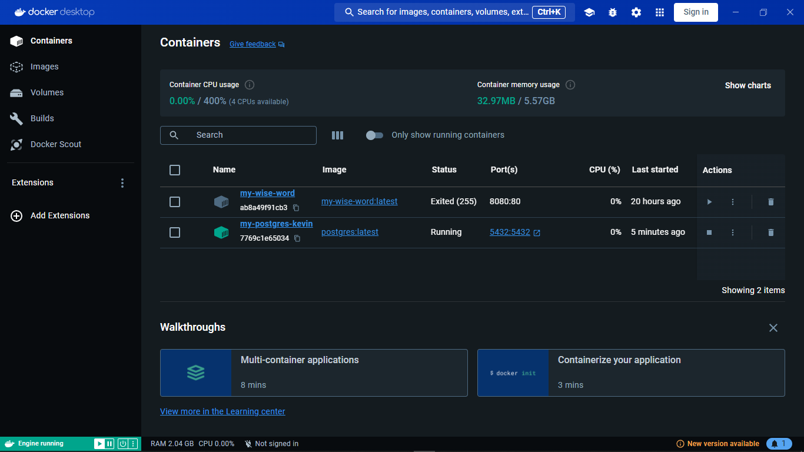
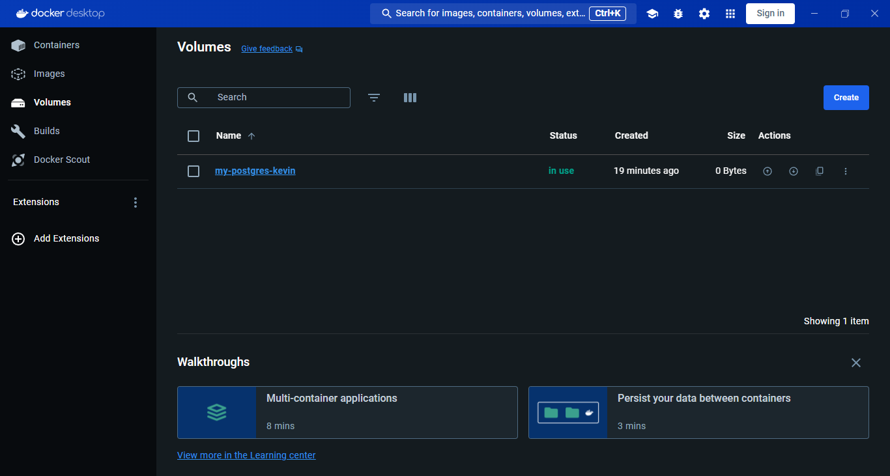
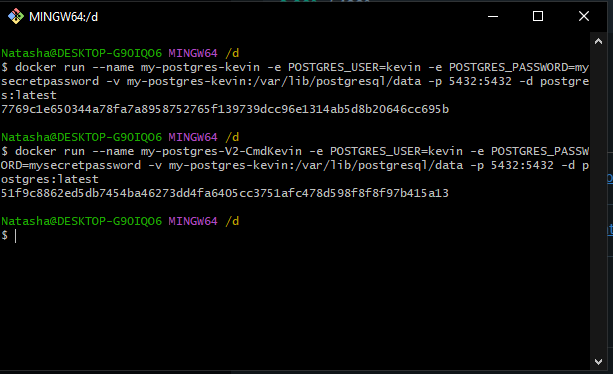
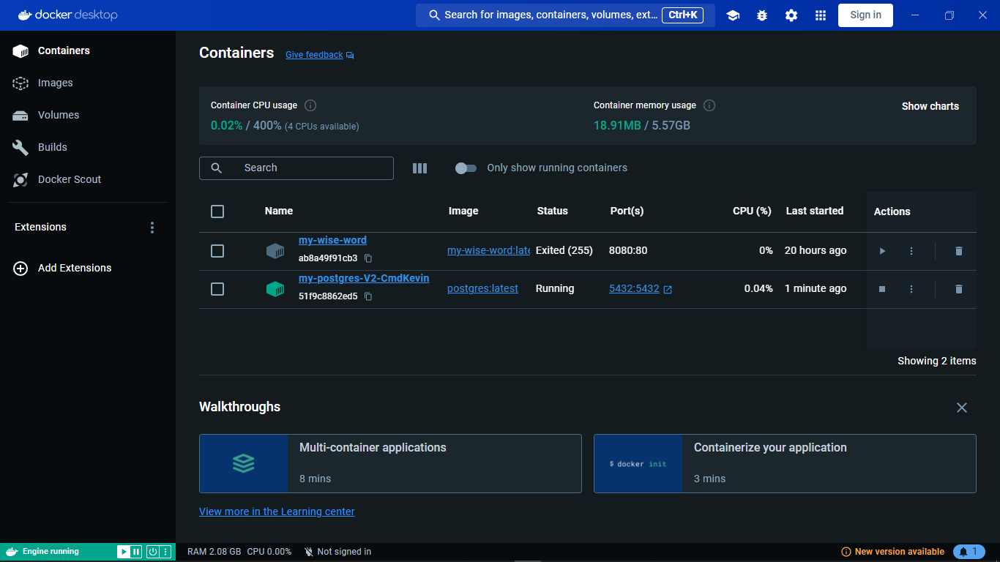
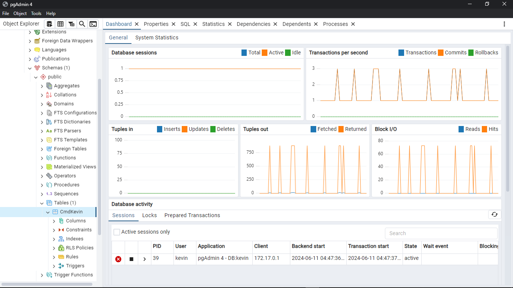

# Practice
## ContainerVolume V1

```sh
docker run --name my-postgres-kevin -e POSTGRES_USER=kevin -e POSTGRES_PASSWORD=mysecretpassword -v my-postgres-kevin:/var/lib/postgresql/data -p 5432:5432 -d postgres:latest
```
## Hasil Container V1


## Hasil Volume Postgress


## Create Table di pgAdmin


## Stop Hapus Container Lama

## Buat Container V2

```sh
 docker run --name my-postgres-V2-CmdKevin -e POSTGRES_USER=kevin -e POSTGRES_PASSWORD=mysecretpassword -v my-postgres-kevin:/var/lib/postgresql/data -p 5432:5432 -d postgres:latest
 ```
 
## Hasil Container V2


## Table Masih Ada

