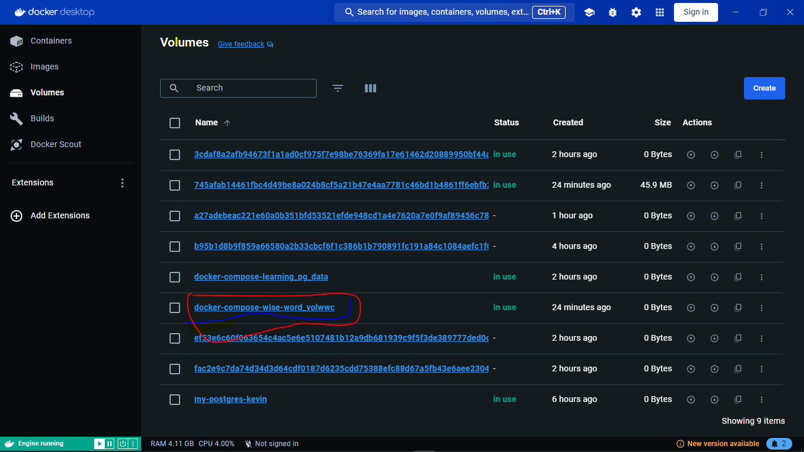
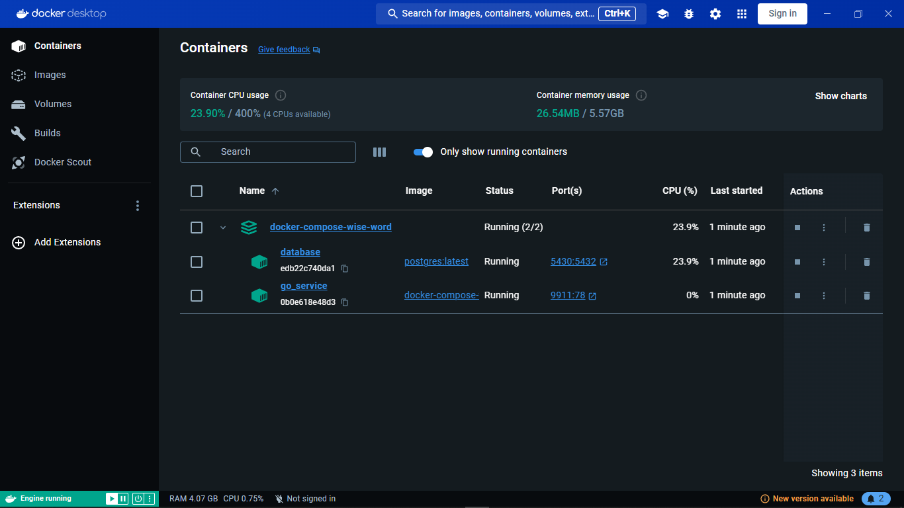
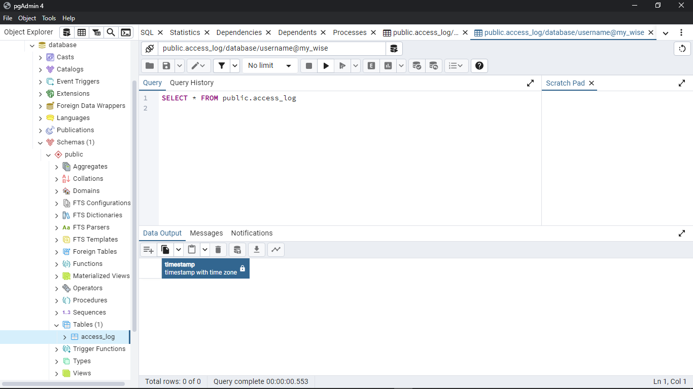
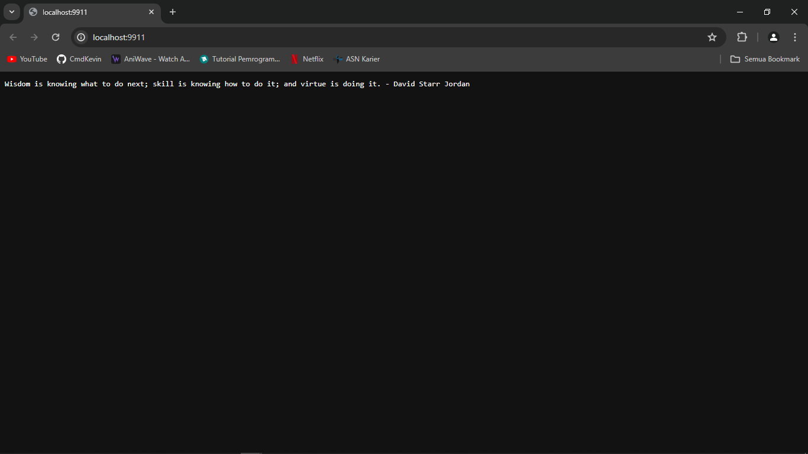
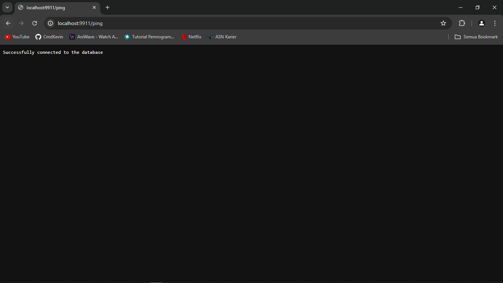
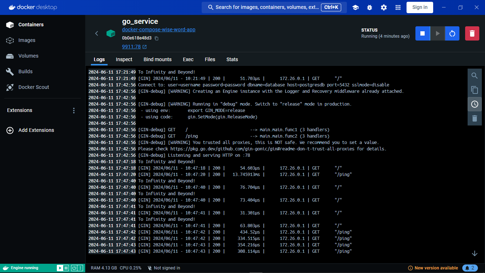

# my-wise-word-compose Result
This is a result of my wise word compose project.

## Hasil Compose Volume

## Hasil Compose Container

## Hasil Database PGadmin

## Hasil DockerPage/

## Hasil DockerPage/ping

## Hasil Logs WiseWord

