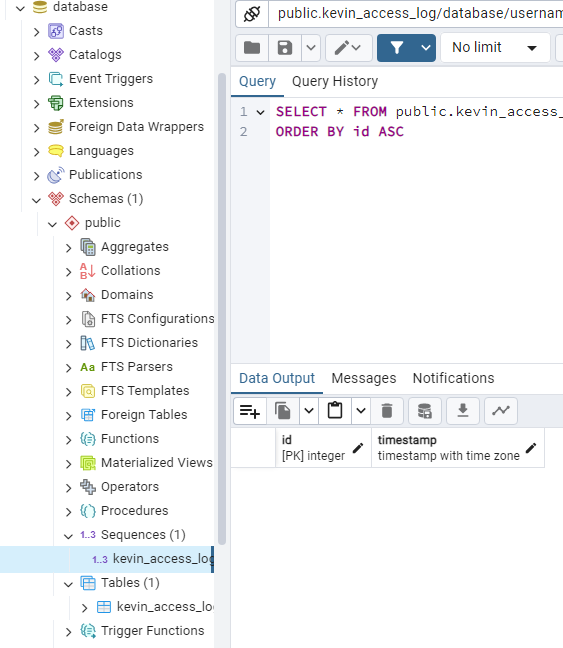
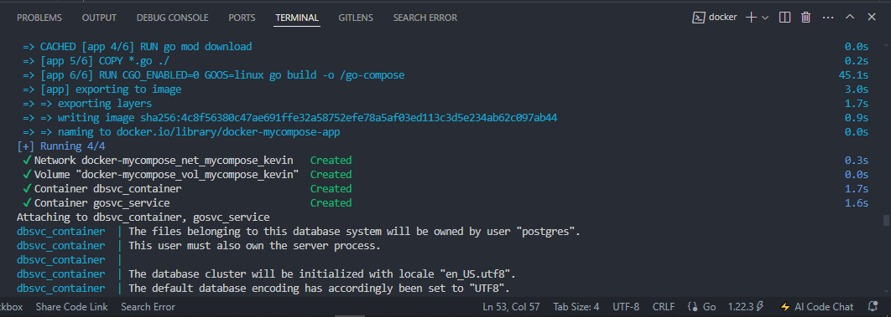
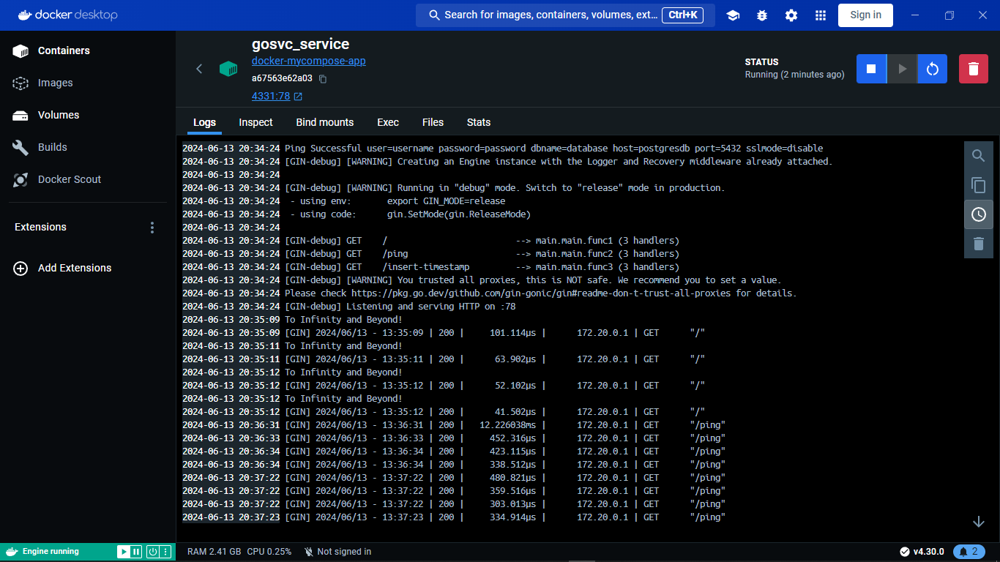
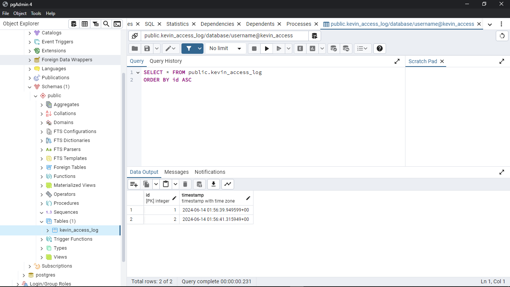

# Project My Compose

## 1. Setup Database dan Table Column


## 2. Setup Project Golang
```bash
package main

import (
	"database/sql"
	"fmt"
	"net/http"
	"os"

	"github.com/gin-gonic/gin"
	_ "github.com/lib/pq"
)

func main() {
	// Get env
	dbUser := os.Getenv("DB_USER")
	dbPass := os.Getenv("DB_PASS")
	dbName := os.Getenv("DB_NAME")
	dbHost := os.Getenv("DB_HOST")
	dbPort := os.Getenv("DB_PORT")

	// Connect to database
	connStr := fmt.Sprintf("user=%s password=%s dbname=%s host=%s port=%s sslmode=disable", dbUser, dbPass, dbName, dbHost, dbPort)
	fmt.Println("Ping Successful", connStr)
	db, err := sql.Open("postgres", connStr)
	if err != nil {
		fmt.Println("Ping Failed", err)
	}

	// Initialize Gin
	router := gin.Default()

	// Define a route for the "/" path
	router.GET("/", func(c *gin.Context) {
		// Print wise words
		c.String(http.StatusOK, "Wisdom is knowing what to do next; skill is knowing how to do it; and virtue is doing it. - David Starr Jordan")

		// Print to console that someone accessed the server
		fmt.Println("To Infinity and Beyond!")
	})

	// Define a route for "/ping" to ping the database
	router.GET("/ping", func(c *gin.Context) {
		// Test ping to database
		if err := db.Ping(); err != nil {
			c.String(http.StatusInternalServerError, "Failed to ping database: %v", err)
			return
		}
		c.String(http.StatusOK, "Pong!")
	})

	// Define a route to insert current timestamp into the database
	router.GET("/insert-timestamp", func(c *gin.Context) {
		// Execute SQL query to insert current timestamp
		_, err := db.Exec("INSERT INTO kevin_access_log (id, timestamp) VALUES (DEFAULT, NOW())")
		if err != nil {
			c.String(http.StatusInternalServerError, "Failed to insert timestamp into database: %v", err)
			return
		}
		c.String(http.StatusOK, "Timestamp inserted successfully")
	})

	// Start the server on port 78
	err = router.Run(":78")
	if err != nil {
		fmt.Println("Error starting server:", err)
	}
}
```

## 3. Create Dockerfile
```bash
# syntax=docker/dockerfile:1
# Use base image with golang included
# See more about golang base image on https://hub.docker.com/_/golang
FROM golang:1.22.3

# Set destination for COPY
WORKDIR /app

# Copy go.mod and execute to download Go modules
COPY go.mod go.sum ./
RUN go mod download

# Copy the source code. Note the slash at the end, as explained in
# https://docs.docker.com/engine/reference/builder/#copy
COPY *.go ./

# Build
RUN CGO_ENABLED=0 GOOS=linux go build -o /go-compose

# To bind to a TCP port, runtime parameters must be supplied to the docker command.
# But we can (optionally) document in the Dockerfile what ports
# the application is going to listen on by default.
# https://docs.docker.com/engine/reference/builder/#expose
EXPOSE 78

# Run
CMD [ "/go-compose" ]
```
## 4. Create Docker Compose
```bash
version: '3.9'
# compose name
name : docker-mycompose

# tell compose to create this all services
services:
  # app service section
  app:
    container_name: gosvc_service
    environment:
      - DB_USER=${DB_USER}
      - DB_PASS=${DB_PASS}
      - DB_NAME=${DB_NAME}
      - DB_HOST=${DB_HOST}
      - DB_PORT=${DB_PORT}
    env_file:
      - .env
    # build with given file
    build:
      context: ./go-compose/
      dockerfile: Dockerfile
    depends_on:
      postgresdb:
        condition: service_healthy
    # port to expose <HOST_PORT>:<CONTAINER_PORT>
    ports:
      - 4331:78
    # container network
    networks:
      - net_mycompose_kevin
    
  postgresdb:
    image: postgres:latest
    container_name: dbsvc_container
    environment:
      - POSTGRES_USER=${DB_USER}
      - POSTGRES_PASSWORD=${DB_PASS}
      - POSTGRES_DB=${DB_NAME}
      - POSTGRES_HOST=${DB_HOST}
    env_file:
      - .env
    healthcheck:
      test: [ "CMD-SHELL", "pg_isready -d ${DB_NAME} -U ${DB_USER}" ]
      interval: 5s
      timeout: 5s
      retries: 5
    ports:
      - '5431:5432'
    volumes:
      - vol_mycompose_kevin:/var/lib/postgressql/data
    networks:
      - net_mycompose_kevin

volumes:
  vol_mycompose_kevin:

networks:
  net_mycompose_kevin:
    driver: bridge
```

## 5. Build Docker Compose


1. Cek logs


2. Cek Root localhost


3. Cek Root localhost/ping


4. Cek Table Sql
