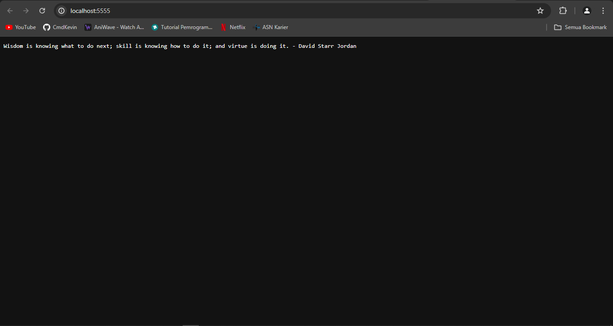
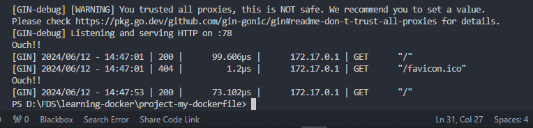
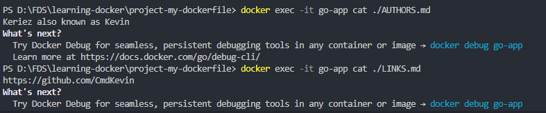
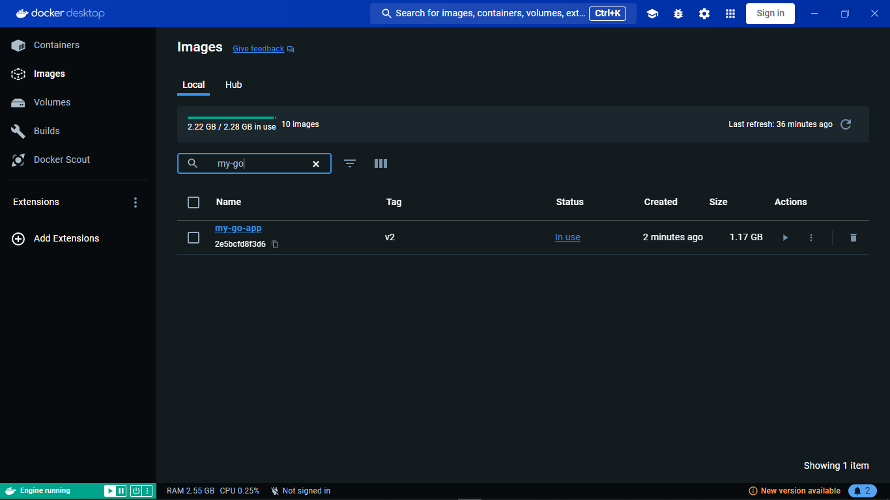

# Langkah-langkah

## 1. Samakan versi golang

samakan versi golang di go.mod dan dockerfile menjadi versi 1.21

## 2. Isi File Golang

```go
package main

import (
	"fmt"

	"github.com/gin-gonic/gin"
)

func main() {
	// Initialize Gin
	router := gin.Default()

	// Define a route for the "/" path
	router.GET("/", func(c *gin.Context) {
		// Print wise words
		c.String(200, "Wisdom is knowing what to do next; skill is knowing how to do it; and virtue is doing it. - David Starr Jordan")

		// Print to console that someone accessed the server
		fmt.Println("Ouch!!")
	})

	// Start the server on port 78
	err := router.Run(":78")
	if err != nil {
		fmt.Println("Error starting server:", err)
	}
}
```

## 3. File Dockerfile

```bash

# syntax=docker/dockerfile:1
# Use base image with golang included
# See more about golang base image on https://hub.docker.com/_/golang
FROM golang:1.21

# Set destination for COPY
WORKDIR /myapp

# Copy go.mod and execute to download Go modules
COPY go.mod go.sum ./
RUN go mod download

# Copy the source code. Note the slash at the end, as explained in
# https://docs.docker.com/engine/reference/builder/#copy
COPY *.go ./

COPY AUTHORS.md ./

COPY LINKS.md ./

# Build
RUN CGO_ENABLED=0 GOOS=linux go build -o /project-my-compose

# To bind to a TCP port, runtime parameters must be supplied to the docker command.
# But we can (optionally) document in the Dockerfile what ports
# the application is going to listen on by default.
# https://docs.docker.com/engine/reference/builder/#expose
EXPOSE 78

# Run
CMD [ "/project-my-compose" ]

```

## 4. Buat Dockerfile image

```bash
docker build -t my-go-app:v2 .
```

## 5. Jalankan Container

```bash
docker run -d --name go-app -p 5555:77 my-go-app:v2
```


## 6. Hasil Running Container


## 7. Cek Logs dan Isi File .md

```bash
 docker logs go-app
 ```


```bash
 docker exec -it go-app cat ./AUTHORS.md
```
```bash
 docker exec -it go-app cat ./LINKS.md
```


## 8. File akhir di Docker Desktop


